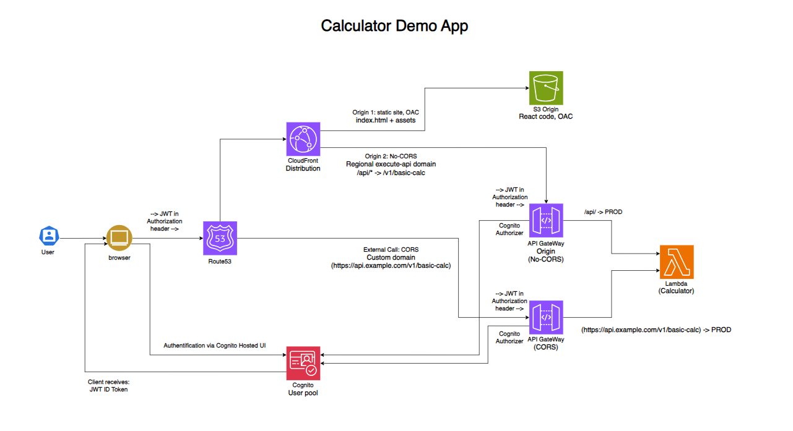
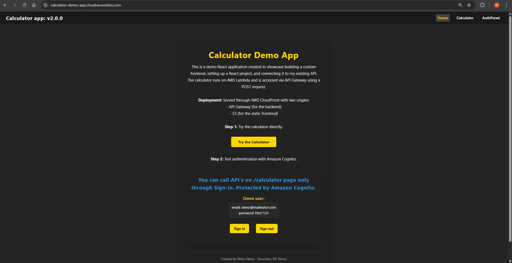
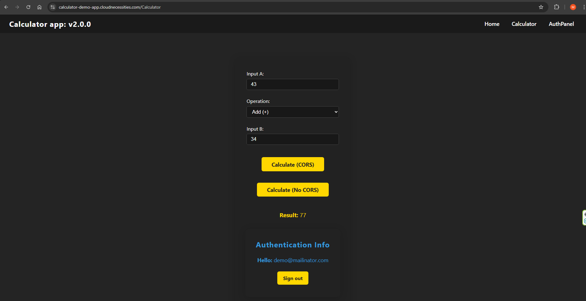
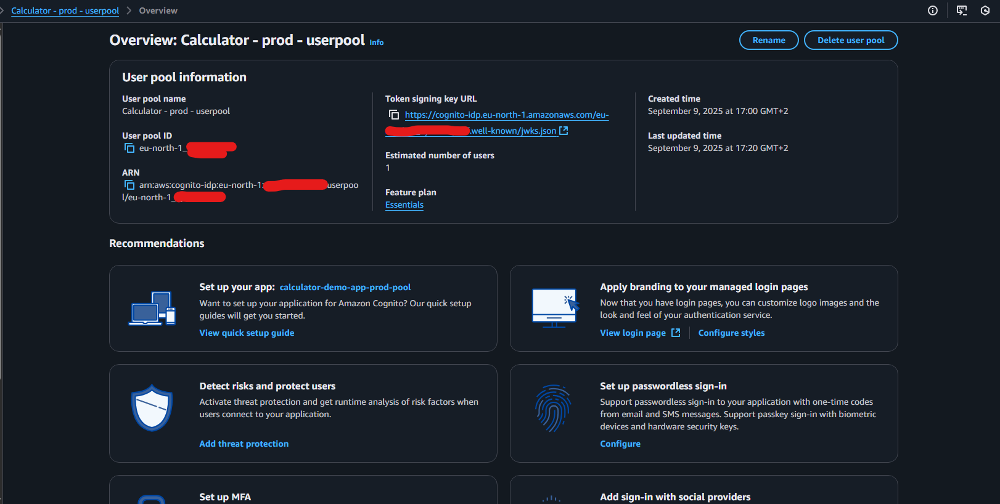
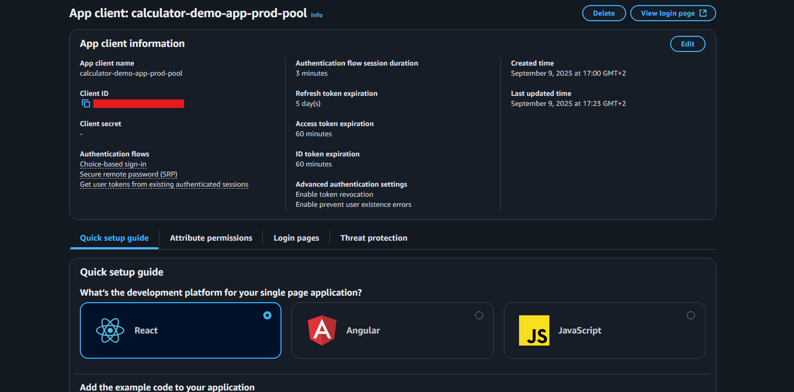
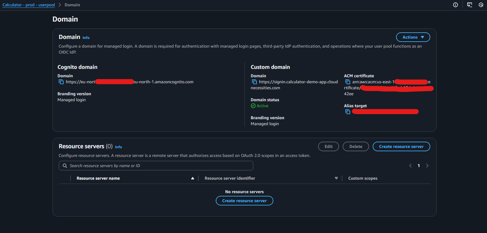
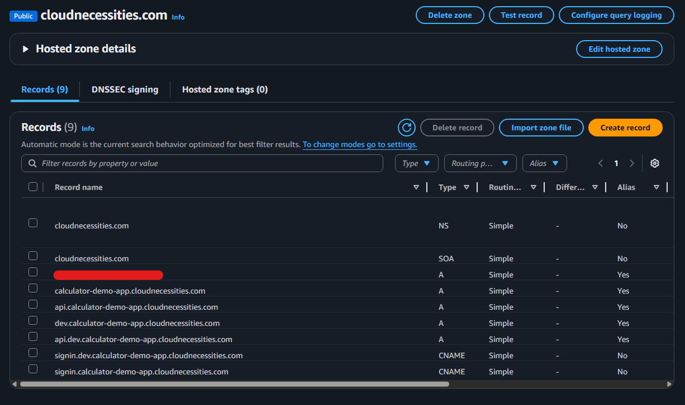
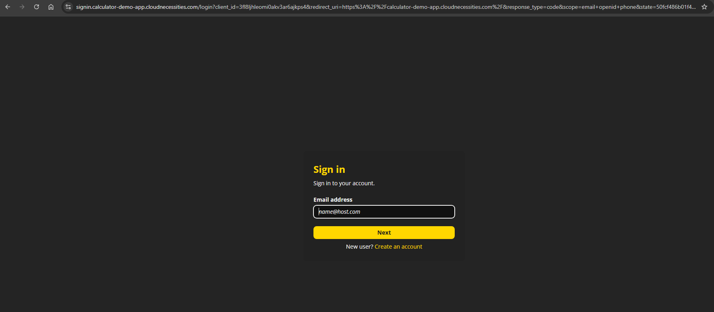
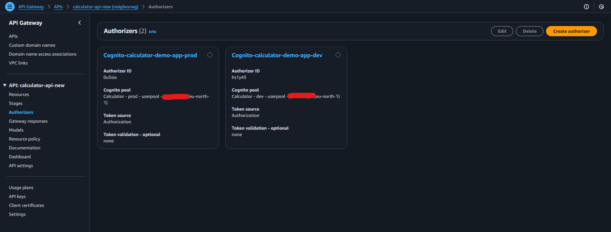

# Calculator Demo App (Serverless on AWS)

🔗 **Live Demo:** [https://calculator-demo-app.cloudnecessities.com/](https://calculator-demo-app.cloudnecessities.com/)  
*version 2.0.0* – Now with **Cognito Authentication & Authorization (NEW Section 9)** 🎉  

---

## Changelog
- **v2.0.0** — Added **Authentication (Amazon Cognito)** with Hosted UI, JWT validation via API Gateway authorizers, and documented prod/dev environments. Updated architecture diagram.
- **v1.0.0** — Initial release: React + Vite frontend, API Gateway + Lambda backend, CloudFront (CORS & No-CORS patterns), OAC, stages & aliases.

---
# Table of Contents

1. [Project Overview](#1-project-overview)  
2. [Architecture](#2-architecture)  
3. [Frontend (React + Vite)](#3-frontend-react--vite)  
4. [Backend (Lambda + API Gateway)](#4-backend-lambda--api-gateway)  
5. [API Integration Patterns (CORS vs No-CORS)](#5-api-integration-patterns-cors-vs-no-cors)  
6. [API Gateway Stages & Stage Variables](#6-api-gateway-stages--stage-variables)  
7. [CloudFront Setup (Origins, Behaviors, OAC)](#7-cloudfront-setup-origins-behaviors-oac)  
8. [Environment Variables & Aliases](#8-environment-variables--aliases)  
9. [Authentication (Amazon Cognito)](#9-authentication-amazon-cognito) 🚀 **NEW in v2.0.0**
10. [Testing & Validation (Postman, Browser, Mobile)](#10-testing--validation-postman-browser-mobile)  
11. [Troubleshooting & Issues Faced](#11-troubleshooting--issues-faced)  
12. [Key Learnings](#12-key-learnings)


---

## <span style="color:#1E90FF">1. Project Overview</span>

This project demonstrates how to build a **full end-to-end serverless application** on AWS by combining a **React frontend (Vite)** with an **API Gateway + Lambda backend**.  

Two live environments are maintained:
  - **Production** → stable, public-facing site, only tested code is deployed
  - **Development** → live test site, used for experimenting and rehearsals against prod APIs

The main use case is a **Calculator Demo App** where users can perform basic arithmetic operations (Add, Subtract, Multiply, Divide) directly from a browser.  

The project also serves as a **learning sandbox** to explore:
- React integration with AWS APIs.
- **CORS vs No-CORS API patterns** (two buttons in the UI call the same Lambda in different ways).
- CloudFront setup with **multiple origins** (S3 for static site, API Gateway for backend (**No-CORS**)).
- **Origin Access Control (OAC)** for securing S3 bucket content.
- **Stage variables & Lambda aliases** for environment separation (dev/test/prod).
- Error handling, caching behaviors, and troubleshooting real-world deployment issues.

**End Goal:**  
Provide a reusable template for future projects where a frontend (React, static site) needs to connect securely and efficiently to AWS serverless backends.


## <span style="color:#1E90FF">2. Architecture</span>

The project follows a **serverless, service-based architecture** where each component is modular but connected through AWS services.

---

### High-Level Components
- **Frontend (React + Vite)**  
  - Deployed as static files to an **S3 bucket**.  
  - Distributed globally via **CloudFront**.  
  - Uses **React Router** for navigation and fetches data from APIs.  

- **Authentication (Amazon Cognito)**  
  - Two Cognito User Pools (prod and dev).  
  - Cognito Hosted UI for authentication.  
  - JWT validation by API Gateway authorizers.  
  - Separation of prod and dev domains.  

- **Backend (AWS Lambda + API Gateway)**  
  - A single **Lambda function** implements calculator logic (basic arithmetic).  
  - Exposed via **API Gateway** with two integration patterns:  
    - **CORS** → direct API call from browser.  
    - **No-CORS** → routed through CloudFront as same-origin.  

- **API Gateway Stages & Stage Variables**  
  - Stages: `dev`, `test`, and `prod`.  
  - Each stage maps requests to different **Lambda aliases** (versioned functions).  

- **CloudFront**  
  - Acts as the **entry point** for the entire application.  
  - **Origin 1** → S3 (static frontend).  
  - **Origin 2** → API Gateway (backend for No-CORS).  
  - Configured with **Origin Access Control (OAC)** for secure S3 access.  

- **IAM & Security**  
  - Lambda execution role with least privilege.  
  - OAC ensures **S3 bucket is private**, accessible only via CloudFront.  

---

### Diagram







This architecture showcases both **CORS and No-CORS patterns**, while following AWS best practices like **OAC**, **stage isolation**, and **Lambda aliasing** for controlled deployments.

## <span style="color:#1E90FF">3. Frontend (React + Vite)</span>

The frontend is a **React Single Page Application (SPA)** bootstrapped using **Vite** for fast development and optimized builds.  
It provides a simple **Calculator UI** with two integration options:  
- **CORS API call**  
- **No-CORS API call (via CloudFront proxy)**  

---

### Features
- **React Router** for multi-page navigation (Homepage, Calculator page).  
- **CalculatorForm.jsx** component includes:  
  - Two numeric inputs (`a` and `b`).  
  - Dropdown to select operation (`add`, `subtract`, `multiply`, `divide`).  
  - Two buttons:  
    - `Calculate (CORS)` → Calls API directly.  
    - `Calculate (No-CORS)` → Calls API via CloudFront proxy.  
  - Displays results and error messages.  
- **CSS Styling** with responsiveness fixes for mobile devices (media queries).  

---

### Build & Deployment
- Local development:
  ```bash
  npm run dev
  ```
- Production build (generates /dist folder):
  ```bash
  npm run build
  ```
- Deployment to S3:
  ```bash
  aws s3 sync ./dist s3://your-s3-bucket-name --delete
  ```
- CloudFront cache invalidation (to refresh updated files):
  ```bash
  aws cloudfront create-invalidation --distribution-id <id> --paths "/*"
  ```


### CORS vs No-CORS in Frontend
- **CORS API Call**
    Uses environment variable (VITE_API_BASE_URL_CORS) pointing to API custom domain.
    ```javascript
    fetch(`${BASE_URL_CORS}/v1/basic-calc`, {
    method: "POST",
    headers: { "Content-Type": "application/json" },
    body: JSON.stringify({ a, b, operation }),
    });
    ```
- **No-CORS API Call**
    Uses relative path, routed through CloudFront behavior (/api/*).
    ```javascript
    fetch(`/api/v1/basic-calc`, {
    method: "POST",
    headers: { "Content-Type": "application/json" },
    body: JSON.stringify({ a, b, operation }),
    });
    ```
**Check frontend code here:** [Frontend](frontend/src/) 

✅ This design allows the same frontend to demonstrate both API integration models without changing Lambda logic.

## <span style="color:#1E90FF">4. Backend (Lambda + API Gateway)</span>

The backend consists of **AWS Lambda functions** exposed through **API Gateway**.  
The calculator logic is fully serverless, lightweight, and stateless.

---

### Lambda
- A single Lambda function handles **basic arithmetic operations**.  
- Supports both:  
  - `GET` → simple checks  
  - `POST` → main calculator logic  

**POST request body:**
```json
{
  "a": 10,
  "b": 5,
  "operation": "add"
}
```
**Response:**
```json
{
  "result": 15
}
```

**Lambda Code:**

[calc-basic-lambda.py](/backend/calc-basic-lambda.py)

### API Gateway

- Created as a **REST API**.  
- Two setups were tested:  
  - **CORS API** → Custom domain (`api.example.com`) with CORS enabled.  
  - **No-CORS API** → Direct stage invocation via CloudFront proxy (`/api/v1/basic-calc`).  

  

**Methods:**
- `POST` → invokes Lambda, processes calculator logic.  
- `OPTIONS` → configured for CORS preflight (CORS setup only).  

---

### Key Points
- Lambda versions published and tied to aliases (`DEV`, `TEST`, `PROD`).  
- API Gateway stages (`dev`, `test`, `prod`) mapped to these aliases via **stage variables**.  
- Both **CORS and No-CORS** APIs are functionally identical — only the **integration pattern differs**.

## <span style="color:#1E90FF">5. API Integration Patterns (CORS vs No-CORS)</span>

This project demonstrates **two ways** of connecting a React frontend to an API Gateway + Lambda backend:  
- **CORS-enabled API calls**  
- **No-CORS API calls (via CloudFront proxy)**  

---

### 1. CORS API Call
**How it works:**
- React frontend calls the API Gateway **custom domain** directly 
- Browser enforces **CORS (Cross-Origin Resource Sharing)** since frontend and API are different origins.  
- API Gateway + Lambda must return:  
- `Access-Control-Allow-Origin`  
- `Access-Control-Allow-Headers`  
- `Access-Control-Allow-Methods`  


**Custom domain set up**


**Route53**


**Frontend code:**
```javascript
const response = await fetch(`${BASE_URL_CORS}/v1/basic-calc`, {
method: "POST",
headers: { "Content-Type": "application/json" },
body: JSON.stringify({ a, b, operation }),
});
```

**Backend requirements (CORS):**
- API Gateway resource with `POST` + `OPTIONS`.  
- `OPTIONS` handles preflight requests.  
- Lambda response includes CORS headers.  

---

### 2. No-CORS API Call (CloudFront Proxy)

**How it works:**
- React app calls a **relative path**:  
```bash
/api/v1/basic-calc
```
- CloudFront has a behavior (`/api/*`) that proxies requests to the API Gateway stage.  
- From the browser’s perspective, both website and API are the **same origin** → no CORS checks.


**Frontend code:**
```javascript
const response = await fetch(`/api/v1/basic-calc`, {
  method: "POST",
  headers: { "Content-Type": "application/json" },
  body: JSON.stringify({ a, b, operation }),
});
```

**Backend requirements (No-CORS):**
- No CORS headers required.  
- CloudFront behavior forwards request to API Gateway.  
- Uses **Origin Request Policy: `AllViewerExceptHostHeader`**.  

---

### Summary Table

| Mode    | Frontend Call                                      | CloudFront Behavior | API Gateway Path      | CORS Headers |
|---------|-----------------------------------------------------|----------------------|-----------------------|--------------|
| CORS    | `https://api.example.com/v1/basic-calc` | N/A                  | `/v1/basic-calc`      | ✅ Required |
| No-CORS | `/api/v1/basic-calc`                               | `/api/*`             | `/api/v1/basic-calc`  | ❌ Not needed |

---

### Why Both?
- **CORS** → Best when exposing APIs for **external/public clients**.  
- **No-CORS** → Best when frontend + backend are served under the **same domain** (via CloudFront) → simpler security & caching.  


## <span style="color:#1E90FF">6. API Gateway Stages & Stage Variables</span>

To support multiple environments (**Dev, Test, Prod**) and enable controlled deployments, this project uses **API Gateway Stages** combined with **Stage Variables**.

---

### Stages
Three stages were created:
- **dev** → used for development testing  
- **test** → used for validation before production  
- **prod** → live environment  

Each stage can point to different **Lambda aliases** (`DEV`, `TEST`, `PROD`) to isolate deployments.  


---

### Stage Variables
Stage variables allow dynamic integration between API Gateway and Lambda without hardcoding ARNs.  

**Example configuration:**
```json
{
  "calcAlias": "PROD"
}
```
**Integration request:**
```ruby
arn:aws:lambda:eu-north-1:<account-id>:function:basic-calc:${stageVariables.calcAlias}
```

### Workflow

1. **Development**  
   - API deployed to `dev` stage  
   - Stage variable → `DEV` (latest Lambda version)  
   - Tested via Postman + React frontend  

2. **Testing**  
   - API deployed to `test` stage  
   - Stage variable → `TEST`  
   - Canary deployments tested here with Lambda + CodeDeploy  

   

   

   

3. **Production**  
   - Stable version deployed to `prod`  
   - Stage variable → `PROD`  
   - Live API:  
     ```
     https://api.example.com/v1/basic-calc
     ```

---

### Key Benefits
- **Flexibility** → same API path (`/v1/basic-calc`) maps to different Lambda versions per stage  
- **Separation** → dev/test can be used without touching production  
- **Rollback** → easy to revert by re-pointing stage variable to previous alias  

## <span style="color:#1E90FF">7. CloudFront Setup (Origins, Behaviors, OAC)</span>

CloudFront was used to serve both the **React frontend** and the **API Gateway backend** with different origins and behaviors.

Origins


---

### Origins
1. **S3 Bucket (Frontend)**  
   - Private bucket secured with **Origin Access Control (OAC)**  
   - Hosts React build files (`index.html`, `assets/`)  
   - Ensures content is only accessible through CloudFront (not directly from S3)  

    Origin

    

    OAC

   

    S3 Bucket

   

2. **API Gateway (Backend, No-CORS)**  
   - Configured as a **custom origin** pointing to the **regional API Gateway domain**  
     (e.g., `abc123.execute-api.eu-north-1.amazonaws.com`)  
   - CloudFront strips the `Host` header with policy **AllViewerExceptHostHeader**  
   - Enables **No-CORS integration** (browser sees API calls as same-origin)  

   Origin

   

---

### Behaviors
- **Default Behavior**  
  - Path: `/`  
  - Origin: **S3 bucket**  
  - **Caching:** Enabled (Optimized for static assets)  
  - **Error pages:** `403` and `404` redirect to `index.html`  
    - Applied at the **distribution level** (affects all origins), not only S3  

- **API Behavior (No-CORS)**  
  - Path pattern: `/api/*` -> production  
  - Origin: **API Gateway (regional domain)**  
  - **Caching:** Disabled (API responses should always be fresh)  

Behaviors


Error pages


---

### CORS vs No-CORS Split
- **CORS API Calls**  
  - Frontend calls API **directly** via custom domain  
    ```
    https://api.example.com/v1/basic-calc
    ```
  - Requires CORS headers in API Gateway + Lambda  

  Cors stages

  

  Custom domain set up

  

- **No-CORS API Calls**  
  - Frontend calls **relative path**  
    ```
    /api/v1/basic-calc
    ```
  - CloudFront proxies request to API Gateway  
  - No CORS headers required (appears same-origin)  

  

---

### Key Points
- **OAC (Origin Access Control):** secures S3 so only CloudFront can fetch content  
- **SPA Support:** error pages redirect unknown routes to `index.html`  
- **Separation of Concerns:** static assets (S3) and dynamic API requests (API Gateway) handled separately  
- **Flexibility:** both CORS and No-CORS patterns demonstrated side by side in one project  

## <span style="color:#1E90FF">8. Environment Variables & Aliases</span>

To manage configuration across **stages (dev, test, prod)** and API styles (CORS vs No-CORS), this project uses both **environment variables** in React and **Lambda aliases** in API Gateway.

---

### React Environment Variables
React (Vite) uses `import.meta.env` for environment variables.  

- Example `.env` file (for CORS API calls):  
  ```env
  VITE_API_BASE_URL_CORS=https://api.example.com
  ```
**In code:**
```javascript
const BASE_URL_CORS = import.meta.env.VITE_API_BASE_URL_CORS;
```
For **No-CORS**, the frontend uses relative paths (e.g., `/api/v1/basic-calc`) → no environment variable needed.  

---

### Lambda Aliases
Lambda versions and aliases separate deployments per stage:  

- `DEV` Alias → points to Lambda version X (development code)  
- `TEST` Alias → points to Lambda version Y (tested code)  
- `PROD` Alias → points to Lambda version Z (production code)  


**API Gateway stage variables reference the correct alias:**
```json
{
  "calcAlias": "PROD"
}
```
This ensures that the same API resource (`/v1/basic-calc`) can be mapped to different Lambda versions depending on the stage.  

---

### Benefits
- **Consistency** → frontend doesn’t need to know internal Lambda versioning  
- **Flexibility** → each stage points to a different Lambda version/alias  
- **Safety** → canary deployments and rollbacks possible by shifting traffic between aliases  
- **Simplicity** → CORS uses env variable for absolute URL, No-CORS uses relative fetch → both supported in one codebase  

## <span style="color:#1E90FF">9. Authentication (Amazon Cognito)</span>

To secure the Calculator Demo App, **Amazon Cognito User Pools** were integrated for both **production** and **development** environments.  
All API requests now require a valid **JWT ID token**, obtained after authenticating via the Cognito **Hosted UI**.

---

### Cognito Setup
- **User Pools**
  - `dev-user-pool` → used by development site
  - `prod-user-pool` → used by production site

  

- **App Clients**
  - Dev: `dev-spa`
  - Prod: `prod-spa`

  

- **Hosted UI Custom Domains (Route 53 + Cognito association)**
  - Dev: `https://signin.dev.calculator-demo-app.cloudnecessities.com`
  - Prod: `https://signin.calculator-demo-app.cloudnecessities.com`

  

  

  

- **OAuth**
  - Flow: **Authorization Code with PKCE**
  - Scopes: `openid email profile`

- **Callback & Logout URLs**
  - Dev site  
    - Callback: `https://dev.calculator-demo-app.cloudnecessities.com/callback`  
    - Logout: `https://dev.calculator-demo-app.cloudnecessities.com/`
  - Prod site  
    - Callback: `https://calculator-demo-app.cloudnecessities.com/callback`  
    - Logout: `https://calculator-demo-app.cloudnecessities.com/`

---

### API Gateway + Lambda Integration
- **API Gateway Authorizers**
  - `dev-cognito-authorizer` (linked to dev pool)  
  - `prod-cognito-authorizer` (linked to prod pool)

  

---

### Lambda Security & CORS
- Each Lambda enforces a strict **CORS allowlist** using environment variables:  

```python
import os, json

ALLOWED_ORIGINS = [
    os.environ['ORIGIN_V1_BASIC_CALCULATOR_PROD'],
    os.environ['ORIGIN_V1_BASIC_CALCULATOR_DEV'],
    os.environ['ORIGIN_V1_BASIC_CALCULATOR_DEV_LOCAL_HOST']
]

def lambda_handler(event, context):
    origin = event.get("headers", {}).get("origin")
    cors_origin = origin if origin in ALLOWED_ORIGINS else ALLOWED_ORIGINS[0]

    return {
        "statusCode": 200,
        "headers": {
            "Access-Control-Allow-Origin": cors_origin,
            "Access-Control-Allow-Methods": "GET,POST,OPTIONS",
            "Access-Control-Allow-Headers": "Authorization,Content-Type",
        },
        "body": json.dumps({"ok": True})
    }
```
Blocks unauthenticated calls (e.g., Postman).  

Only requests with valid **Origin** + `Authorization: Bearer <ID_TOKEN>` are accepted.  

---

## Frontend Environment Management (IMPROVED in v2.0.0)

### Env Files 
- `.env.dev` → dev site build (uses dev pool/API)  
- `.env.prod` → prod site build (uses prod pool/API)  

---

## Deployment Workflow

### Dev Build
```bash
npm run build -- --mode dev
aws s3 sync ./dist s3://site.bucket/dev --delete
aws cloudfront list-distributions --query "DistributionList.Items[*].[Id,DomainName,Comment]" --output table
aws cloudfront create-invalidation --distribution-id <DEV_CF_ID> --paths "/*"
```
### Prod Build
```bash
npm run build -- --mode prod
aws s3 sync ./dist s3://site.bucket/prod --delete
aws cloudfront list-distributions --query "DistributionList.Items[*].[Id,DomainName,Comment]" --output table
aws cloudfront create-invalidation --distribution-id <PROD_CF_ID> --paths "/*"
```


## <span style="color:#1E90FF">10. Testing & Validation (Postman, Browser, Mobile)</span>

Throughout the build, I validated the setup at multiple levels to ensure correctness and stability.  

---

### 1. Postman (API Testing)
- Used **Postman** to test API Gateway endpoints directly (`/v1/basic-calc`).  
- Sent **POST requests** with JSON body:
  ```json
  {
    "a": 10,
    "b": 5,
    "operation": "add"
  }
    ```
**Verified:**
- Correct Lambda execution  
- Proper JSON response format  
- CORS headers on the CORS-enabled API  
- No CORS headers required for the CloudFront (No-CORS) setup  

✅ This confirmed both CORS and No-CORS APIs worked as expected.  

---

### 2. Browser (React App)
- Deployed frontend with `npm run build` → synced `dist/` to S3.  
- Served via CloudFront with OAC enabled.  

**Verified (desktop browser):**
- React Router navigation worked after fixing error pages (see note below).  
- Calculator form triggered both flows:  
  - **CORS:** `https://api.example.com/v1/basic-calc`  
  - **No-CORS:** `/api/v1/basic-calc` (proxied by CloudFront behavior)  

✅ Both calculation flows returned valid results.  

> **Note (403/404 fix):** Initially, refresh on routed pages returned **403/404** because `index.html` was not configured in CloudFront error pages. Adding 403/404 → `index.html` at the **distribution level** fixed it (affected browser; same symptom would occur on mobile too).  

---

### 3. Mobile Device
- Tested on **Android (Chrome)**.  

**After desktop fix replicated to mobile:**
- SPA routes worked (thanks to error-page redirect to `index.html`).  
- Both CORS and No-CORS buttons worked.  

✅ Cross-device compatibility confirmed.  

---

### 4. Validation Summary
- **Postman** → backend logic + CORS headers  
- **Browser (Desktop)** → frontend + API integration + SPA routing  
- **Mobile** → responsive UI + SPA routing  

All three layers (**frontend, backend, delivery**) tested and confirmed.  

---

### Important Gotcha Discovered (405 & Custom Domain)
- Saw **405 errors** while attempting No-CORS via CloudFront with an API Gateway **custom domain** as origin.  
- **Root cause:** For No-CORS, CloudFront must use the **regional `execute-api` domain** (not the custom domain) so the managed origin request policy **“AllViewerExceptHostHeader”** can be applied.  
- **Fix:** Point CloudFront origin to the new **regional `execute-api` URL** (created a new API without a custom domain for No-CORS). Keep the **custom domain only for the CORS path**.  


## <span style="color:#1E90FF">11. Troubleshooting & Issues Faced</span>

This project was not a straight path — I hit multiple issues along the way and fixed them one by one.  
Documenting them here shows the **real-world debugging process**.  

---

### 1. React Router 403/404 Errors
- **Problem:** Refreshing a React page (`/calculator`) returned **403 or 404** errors.  
- **Cause:** CloudFront attempted to resolve subpaths as files in S3.  
- **Fix:** Configured **custom error pages** (403/404 → redirect to `index.html`).  
✅ React Router now works correctly as an SPA.  

---

### 2. CORS Not Working Initially
- **Problem:** API requests from the React app failed due to **CORS policy errors**.  
- **Cause:** Missing `OPTIONS` method and `Access-Control-Allow-Origin` headers in API Gateway.  
- **Fix:**  
  - Added `OPTIONS` method in API Gateway.  
  - Configured CORS headers (`Access-Control-Allow-Origin`, `Allow-Methods`, etc.).  
✅ Fixed CORS errors.  

---

### 3. API Gateway Custom Domain Conflict
- **Problem:** Couldn’t enable **AllViewerExceptHostHeader** policy in CloudFront when using API Gateway **custom domain**.  
- **Cause:** CloudFront requires direct connection to the **regional API Gateway domain** to manage host headers.  
- **Fix:**  
  - For **No-CORS setup**, CloudFront pointed to the new `execute-api` domain.  
  - For **CORS setup**, kept API Gateway custom domain (`api.example.com`).  
✅ Both setups now work side by side.  

---

### 4. API Path & Integration Issues
- **Problem:** While wiring up the frontend to backend, I had repeated errors (initially looked like 403/405) when testing requests through CloudFront.  

- **Cause:** Confusion around how different pieces interact:  
  - **CORS path** → frontend must call the API Gateway **custom domain** directly.  
  - **No-CORS path** → frontend must call a **relative path** (e.g., `/api/v1/basic-calc`), which CloudFront then forwards to the correct API Gateway stage.  
  - **CloudFront behaviors** → must be set up so `/api/*` maps to the API Gateway origin.  
  - **Stage variables** → determine which Lambda alias (dev/test/prod) is invoked behind the scenes.  

- **Fix Attempts:**  
  - Tried using **Lambda@Edge** to rewrite requests and route traffic to `index.html` instead of configuring error pages. This worked partially but was unnecessary once CloudFront’s error pages were properly configured.  
  - Initially attempted to use the **same API with a custom domain** for both CORS and No-CORS flows. This failed because CloudFront requires the managed policy **AllViewerExceptHostHeader**, which cannot be applied to an API Gateway custom domain.  

- **Final Fix:**  
  - **CORS button** → `${BASE_URL_CORS}/v1/basic-calc` (calls custom domain API).  
  - **No-CORS button** → `/api/v1/basic-calc` (CloudFront forwards to regional `execute-api` domain).  
  - Split APIs: kept one with a **custom domain** (CORS) and one without (No-CORS) so CloudFront could apply the correct origin request policy.  

✅ Once aligned, both CORS and No-CORS flows worked consistently.  


---

### 5. Mobile UI Not Responsive
- **Problem:** UI looked fine on desktop but broken on mobile.  
- **Fix:** Added **CSS media queries** to adjust layout for smaller screens.  
✅ Now responsive.  

---

### Troubleshooting Summary
Every issue was solved by carefully checking:  
- API Gateway mappings, methods, headers  
- CloudFront origins, behaviors, and error pages  
- Lambda response formatting  
- React frontend logic and routing  

This hands-on debugging reinforced **real-world cloud problem-solving**.  


## <span style="color:#1E90FF">12. Key Learnings</span>

This project was more than just building a calculator — it was about exploring **how real-world cloud applications are wired together** and securing them end-to-end.

---

### 🟢 React + Cloud Integration
- Connecting a **React SPA** to AWS services requires careful handling of **routing** and **static hosting** (CloudFront error pages → `index.html`).
- Split frontend calls to demonstrate **CORS** vs **No-CORS** from the same UI without changing backend logic.

---

### 🟢 Authentication & Authorization (Cognito)
- **Cognito Hosted UI + Authorization Code (PKCE)** is a clean way to add login to SPAs without storing secrets.
- Keep **callback/logout URLs** consistent everywhere (Cognito app client, README, frontend).
- **API Gateway Cognito Authorizers** offload JWT validation before Lambda runs.
- Enforce a **strict CORS origin allowlist** in Lambda to block tools like Postman and only trust your frontend domains.
- Prefer storing tokens in **sessionStorage** (or memory) for SPAs; be explicit about your storage choice and tradeoffs.

---

### 🟢 Environments & Deployment Safety
- Maintain **two live environments**:
  - **Production** → stable, public-facing, **only tested code**.
  - **Development** → safe place to experiment and do **prod dress rehearsals**.
- A **dev UI with prod Cognito/API** (rehearsal) validates auth flows and domains without touching the prod site.
- Centralize general env/build steps (Section 8); scope **auth-specific** envs/deploy to Section 9 to avoid confusion.

---

### 🟢 API Gateway Patterns
- **CORS** → direct API custom domain; requires CORS headers and OPTIONS handling.
- **No-CORS** → CloudFront `/api/*` → **regional `execute-api`** origin using **AllViewerExceptHostHeader**; no CORS headers needed.
- Don’t point CloudFront at an **API custom domain** for No-CORS; use the **regional** domain to avoid 405s and header issues.

---

### 🟢 CloudFront Behavior
- Multiple origins (S3 + API Gateway) with path-based routing is powerful; apply **SPA error page redirects at the distribution level**.
- **OAC** keeps the S3 bucket private and enforces CloudFront as the only entry point.

---

### 🟢 Lambda & Release Management
- **Lambda aliases** + **API Gateway stage variables** cleanly separate `dev/test/prod`.
- Canary strategies (CodeDeploy) and quick rollbacks via alias re-pointing reduce risk.
- Return well-formed JSON and explicit headers; be intentional about **no caching** for API paths.

---

### 🟢 Debugging & Troubleshooting
- 403/404/405 issues usually trace back to **behaviors, headers, or error-page scope**.
- When something mysterious breaks, validate each layer independently: **frontend → CloudFront → API Gateway → Lambda**.

---

✅ **End Result:** A working, secure, end-to-end demo proving integration of **React, CloudFront (OAC), API Gateway, Lambda, and Cognito**—while handling real-world challenges like **CORS, JWT validation, multi-env deployments, caching, routing, and security**.


## Hashtags
#AWS #Serverless #CloudComputing #Lambda #APIGateway #Cognito #CloudFront #S3 #React #Vite #DevOps #SolutionArchitecture